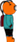

# Blocktopus

#### Project 1, General Assembly WDI

Welcome to Blocktopus!  This is Pauli =>  

Pauli is a deep sea diver in charge of recovering lost treasure from a shipwreck.  There's a problem though--a vicious blocktopus is in the way!  Your job is to help Pauli collect as much treasure as possible while steering clear of the vicious blocktopus tentacles!

## How to run the game

## Technologies Used

+ HTML
+ CSS
+ javascript

## The Approach

There are three main parts to Blocktopus:

+ An animation loop
+ Functions, objects, and constructors that are responsible for rendering everthing on the screen and updating their position
+ A collision detection function that checks whether Pauli has hit a coin or a tentacle.

#### The Aniation loop

The animation loop is the main body of the game.  Each iteration of the loop renders everything to the screen, creates any necessary coins, fish, or bubbles, runs the collision detection function, and then finally calls the functions to update each object's position in preparation for the next iteration.  

#### Functions, objects, and constructors

Aside from the Blocktopus itself and the static background image, everything else rendered to the screen is stored in an object.  Pauli as well as the coins, bubbles, and fish are all objects that have properties to store their speed and position as well as methods that tell them how to draw themselves, update their position, and remove themselves if they are no longer needed.

#### Collision detection

There are two kinds of collision detection in Blocktopus.  In order to check for collisions with tentacles, the game iterates over every pixel in a rectangle slightly larger than Pauli and checks to see if its color matches that of a tentacle.  If there is a match, a collision is triggered.  In order to keep the number of pixels checked to a minimum (the function stops iterating over pixels if it finds a match) collisions with coins are detected simply by checking if the coordinates of the coin fall within Pauli's coordinates.  Although this results in slightly less accurate detection, the coins themselves are small enough that the gameplay is not really affected.

## Unsolved Problems

#### Mechanics

Because the movement mechanics reverse Pauli's direction near the edge of the screen, he will occasionally get "stuck" along the edge of the canvas until he dies or the page is refreshed.  I have attempted to compensate for this by making him bounce a slightly before the edge of the screen, but it still occasionally happens.

#### Screen Sizing 
